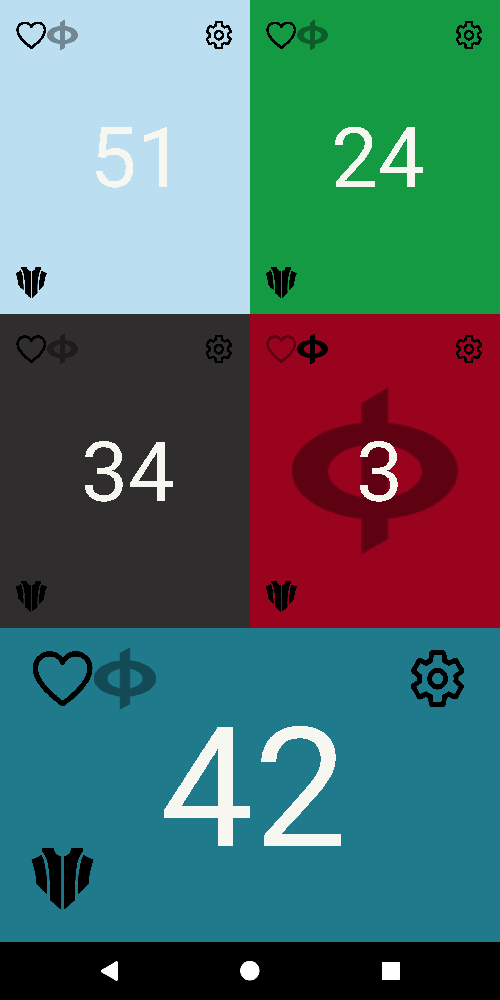

# MTG-Life-Counter-Mobile

The app focuses in the card game Magic the Gathering and has features related to it, but is not restricted to this game.
Featuring a simple way to keep Commander's damage and poison counters for up to six players.
Based on the support received by the application, it will continue polishing according to the requests of the users.

[Go to the play store](https://play.google.com/store/apps/details?id=org.atlas.mtglifecounter "Play Store")

Main Menu                  |  Game Menu
:-------------------------:|:-------------------------:
  |  

Set Players                  |  Settings
:-------------------------:|:-------------------------:
  |  
